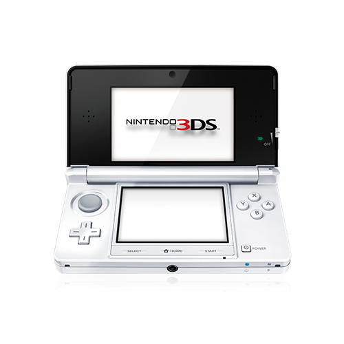
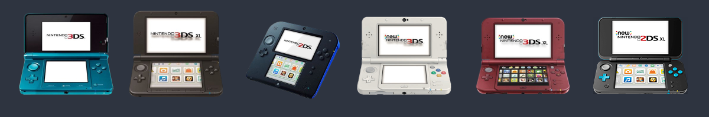
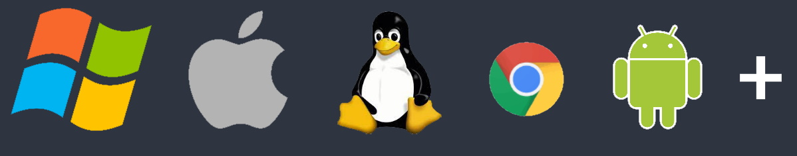

  

    <picture>
      <source media="(prefers-color-scheme: dark)" srcset="assets/images/stock/pantera-1.4.png">
      <source media="(prefers-color-scheme: light)" srcset="assets/images/stock/pantera-1.3.png">
      
    </picture>
  

   

  
  
  
  

  <picture>
    <source media="(prefers-color-scheme: dark)" srcset="assets/images/stock/hardware_2011_Nintendo_3DS_large_white.png">
    <source media="(prefers-color-scheme: light)" srcset="assets/images/stock/hardware_2011_Nintendo_3DS_large_black.png">
        
  </picture>

# Overview
This Repository is a commprehensive guide on how to "hack"/mod your Nintendo 3DS. With this guide you will be installing Custom Firmware (CFW), meaning a full software modification to your Nintendo, comparable to an "administrator access" on a computer. It allows you to do anything that the 3DS is physically capable of doing, rather than being limited by whatever Nintendo allows you to do. Now what does this guide **exactly** install?
This guide will:

- Install boot9strap and Luma3DS custom firmware on unmodified retail 3DS/2DS consoles
    - Luma3DS will automatically remove the region lock and allow you to run unsigned software
- Install various pieces of homebrew software, such as a package installer, save file manager, and a homebrew app store
- Make critical system file backups that can help avoid bricks (and recover data in the event of one)

>[!WARNING]
>By modding your console, you subject it to the remote (but non-zero) possibility of the console being bricked (rendered non-functional). Incorrect file placement will NOT brick your console, but purposely skipping instructions might.

In short: Modding your console is safe, but it's your responsibility if something goes wrong.

 

# What consoles is this gudie compatible with?

This guide works with every retail console in the Nintendo 3DS family of consoles (*including the 3DS, 3DS XL/LL, 2DS, New 3DS, New 3DS XL/LL, and New 2DS XL/LL*), regardless of region or firmware. It is **NOT** compatible with the DSi family of consoles (DSi, DSi XL/LL).

# What kind of computer / hardware do you need to follow this guide?

In most cases, you can follow this guide as long as you are able to download files from the Internet and copy them to your SD card. Depending on your computer/phone/electronic device, you may need to purchase a USB to SD card adapter to allow your computer to read your SD card.
